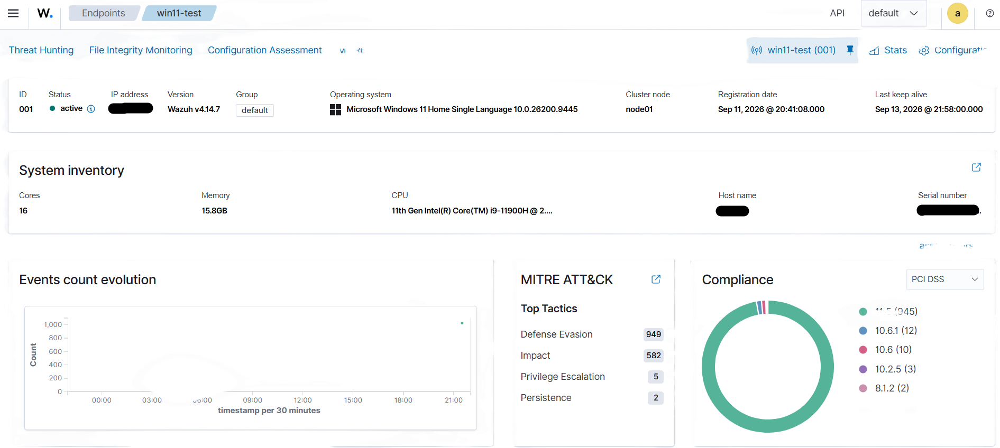
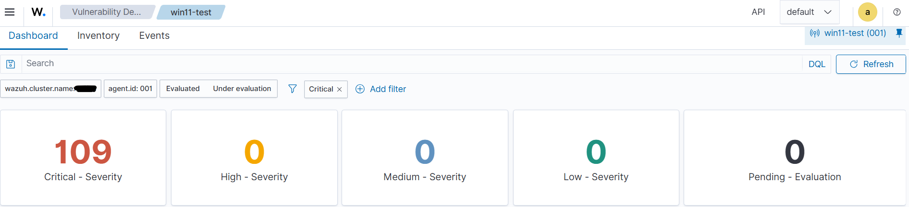
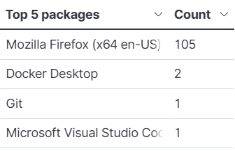
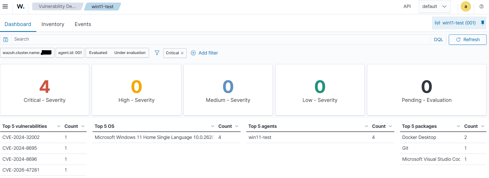

# SOC Home Lab — Troubleshooting Log

## Overview
**Environment:** A single Windows 11 laptop running two layers — Ubuntu via **WSL2** (Wazuh Manager, Indexer, Dashboard) and the native Windows host itself (Wazuh Agent, hostname `WIN11-LAB-01`).
**Goal:** Build a functioning SIEM lab to practice log monitoring, agent management, and vulnerability detection triage.

---

## Case 1 — "Invalid Agent Name" Enrollment Error

**Symptom**
Agent installation completed and the Windows service was running, but the manager log rejected enrollment with:
```
ERROR: Invalid agent name: WIN11-LAB-01. Unable to add agent (from manager)
```

**Investigation**
1. Checked the Wazuh Dashboard's Agents list for any existing entry using the same hostname.
2. Found a stale/incomplete agent registration left over from an earlier failed installation attempt.

**Root Cause**
A previous installation attempt had partially registered an agent under the same name in the manager's agent database, causing a naming conflict on re-enrollment.

**Resolution**
1. Removed the stale agent entry from the manager (`manage_agents` / Dashboard delete).
2. Cleared the leftover `client.keys` file on the Windows host to remove the old registration reference.
3. Re-ran the agent deployment command from the Dashboard's "Deploy new agent" flow.


*Agent now showing as Active in the Wazuh Dashboard's Agents summary.*

**Lesson Learned**
Failed installs can leave partial state behind (both on the agent and manager side). When re-registering, check for and clean up stale entries on *both* ends, not just the one that errored.

---

## Case 2 — 109 Critical Vulnerabilities on a Fresh Windows VM

**Symptom**
Wazuh's Vulnerability Detection module reported 109 Critical-severity findings on the Windows 11 host shortly after enrollment.


*Vulnerability Detection summary before remediation — 109 Critical-severity findings.*

**Investigation**
Drilled into the Vulnerability Detection dashboard's "Top 5 packages" breakdown, which attributed 105 of the 109 findings to a single package: Mozilla Firefox.


*"Top 5 packages" breakdown — Mozilla Firefox accounts for 105 of the 109 Critical findings.*

**Root Cause**
The Windows host had an outdated Firefox installation with several years' worth of unpatched CVEs (browser software accumulates CVEs quickly due to frequent security releases).

**Resolution**
Since Firefox was not actively used on this VM, it was uninstalled entirely rather than patched — reducing the attack surface instead of maintaining a browser with no operational need.


*Vulnerability Detection summary after uninstalling Firefox — Critical findings dropped significantly.*

**Lesson Learned**
Applied the security principle of **attack surface reduction**: unused software should be removed rather than maintained, since every installed package is a potential vulnerability source regardless of whether it's ever opened.

---

## Tools Used
- WSL2 (Windows Subsystem for Linux) running Ubuntu
- Wazuh (SIEM: manager, indexer, dashboard, agent)
- Windows 11 (native host, agent endpoint)

## Skills Demonstrated
- Log-based root cause analysis (`ossec.log`, `systemctl status`)
- Agent lifecycle management (enrollment, deregistration, re-enrollment)
- Vulnerability triage and attack surface reduction reasoning
